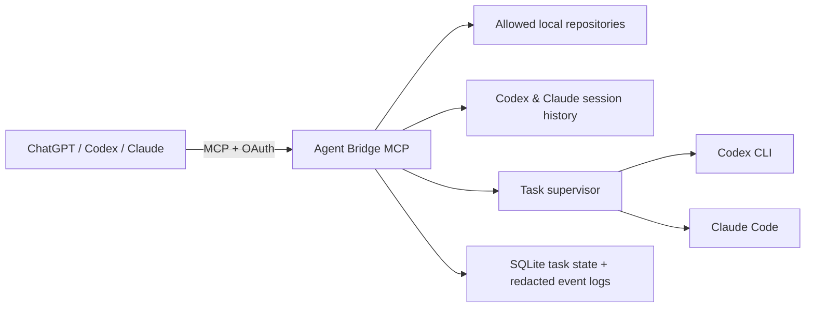

# Agent Bridge MCP

> A local agent orchestrator for supervising coding agents across your repositories.

Agent Bridge MCP gives ChatGPT, Codex CLI, and Claude Code a controlled view of
the repositories on your Mac. A connected MCP client can inspect repository
context, review Codex and Claude Code sessions, start or continue supervised
agent tasks, and retrieve redacted task output.

The bridge is the control plane. Codex CLI and Claude Code remain the workers;
your Mac remains the source of truth for files, access policy, and credentials.

## Why it exists

Running several coding agents across several repositories quickly becomes hard
to follow: which repository is safe to inspect, which task is still running,
what did an agent change, and where did it fail?

Agent Bridge MCP provides a deliberately small orchestration surface instead
of handing a remote client a shell on your machine. It makes existing agent
work observable and controllable while keeping repository access under a
policy only the owner can change.



## What it can do today

### Inspect repository context

- List files and directories below an allowed root.
- Read bounded line ranges from text files.
- Search for literal text across an allowed path.
- Enforce a fixed ignore list for `.git`, `.env*`, `node_modules`, and common
  build or cache output.

### Observe agent work

- Discover and read Codex CLI and Claude Code session history within allowed
  repositories.
- List bridge tasks and retrieve their current state.
- Read paginated, redacted output events for a task.
- Preserve task metadata and logs across bridge restarts; active tasks that can
  no longer be supervised are marked `interrupted`.

### Coordinate coding agents

- Start Codex or Claude Code in an allowed working directory.
- Continue a finished or waiting provider session as a linked child task.
- Cancel a running task, including its process group.
- Bound prompt size and concurrent work globally and per provider.

## MCP tool surface

Every request requires `agent:read`. Mutating tools also require
`agent:write` and are declared non-read-only so compatible MCP clients can
ask for approval before they run.

| Area | Tool | Access | Purpose |
|---|---|---:|---|
| Repository | `repo_list` | Read | List files and directories under an allowed path. |
| Repository | `repo_read` | Read | Read a text file by line range. |
| Repository | `repo_search` | Read | Search literal text under an allowed path. |
| Sessions | `session_list` | Read | Find Codex and Claude Code sessions in allowed repositories. |
| Sessions | `session_read` | Read | Read one paginated provider session. |
| Tasks | `agent_list` | Read | List bridge tasks by provider or state. |
| Tasks | `agent_status` | Read | Get the state of one task. |
| Tasks | `agent_output` | Read | Read paginated, redacted task events. |
| Tasks | `agent_start` | Write | Start a Codex or Claude Code task. |
| Tasks | `agent_continue` | Write | Continue a finished or waiting task. |
| Tasks | `agent_cancel` | Write | Cancel a running task. |

## Security boundary

The connected client is not trusted to decide what it may reach.

- **Owner-controlled access policy.** Reachable paths live in a local
  allowlist/denylist config file. MCP tools cannot edit it.
- **Deny wins.** Denied paths are refused directly, hidden from listings,
  skipped by search, and rejected as task working directories.
- **Loopback-only server.** The HTTP server binds only to `127.0.0.1`.
  Cloudflare Tunnel is optional and is the only supported public ingress.
- **OAuth and scopes.** Enrolled deployments use OAuth 2.1 with PKCE, dynamic
  client registration, rotating refresh tokens, and `agent:read` /
  `agent:write` scopes. Loopback clients can use a local bearer token.
- **OpenAI Secure MCP Tunnel.** Its broker is an alternative connection
  boundary: run it in `openai-tunnel` mode and choose **No authentication**
  when connecting in ChatGPT. This mode remains loopback-only and does not
  expose the bridge's HTTP OAuth endpoints.
- **Secret-safe persistence.** Authorization codes, OAuth tokens, the recovery
  code, and local bearer token are stored as SHA-256 hashes.
- **Redaction before egress.** Repository content, provider session history,
  and task output use the same secret-redaction layer before leaving the Mac.
- **No arbitrary shell.** There is no `run_shell`, arbitrary executable,
  environment override, sandbox-bypass flag, or direct file-writing MCP tool.
  Code changes are performed only through supervised provider tasks.

> Before `npm run enroll-owner` has completed, the bridge permits an
> unauthenticated loopback bootstrap mode. Do not expose it through a tunnel or
> any public network path until owner enrollment is complete.

## Orchestration roadmap

The current release establishes the secure execution and observation layer.
The next work should make it feel like an orchestrator rather than a remote
task launcher.

### Completed

- [x] Read repository files and search allowed repositories.
- [x] Inspect Codex and Claude Code session history.
- [x] Start, continue, monitor, and cancel provider tasks.
- [x] Persist task state and redact output.
- [x] Enforce owner-managed file policy, OAuth, and scoped write access.
- [x] Run as a loopback macOS service with optional Cloudflare ingress.

### Next priorities

- [ ] **Repository intelligence:** `repo_status`, `repo_diff`, `repo_log`,
  and a repository overview built from fixed, read-only Git operations.
- [ ] **Task queue:** priorities, queued execution, pause/resume, and limits
  per repository as well as per provider.
- [ ] **Task timeline:** normalized provider events such as running,
  waiting-for-input, completed, failed, and cancelled.
- [ ] **Watch and notification:** notify only when a task completes, fails,
  needs input, or exceeds a time limit.
- [ ] **Structured workflows:** review a diff, investigate a failure, plan
  work, and hand off useful context between providers.
- [ ] **Task memory:** retain summaries, decisions, relevant files, Git
  revision, and parent/child relationships for safe continuation.
- [ ] **Cross-repository workspaces:** group related repositories without
  bypassing the access policy.

### Intentionally out of scope

- An arbitrary remote shell.
- Direct file-write or executable-run MCP tools.
- Automatically widening access policy from a connected client.
- A web dashboard before the queue, timeline, and workflow model are stable.

## Requirements

- macOS with Codex CLI and/or Claude Code installed **and logged in**. The
  bridge starts these CLIs; it cannot authenticate them for you.
- Node 26, as pinned by [`.nvmrc`](.nvmrc). `better-sqlite3` is native, so it
  must be compiled for the Node version that runs the service.
- A Cloudflare account and domain only when remote access is required.

## Quick start

```bash
npm install
cp .env.example .env       # edit the public URL and initial allowed folders
npm run verify             # typecheck, test, build
npm run enroll-owner       # prints a recovery code and local bearer token once
scripts/install-services.sh
```

Save the recovery code and local bearer token in a password manager. They are
shown only at enrollment and cannot be recovered from the SQLite database.

`.env` is git-ignored and holds deployment settings such as the public HTTPS
endpoint and initial allowlist roots. It does not store OAuth tokens, recovery
codes, bearer tokens, or tunnel credentials.

For the Cloudflare and LaunchAgent setup, see
[docs/OPERATIONS.md](docs/OPERATIONS.md). For connecting ChatGPT, Codex CLI,
or Claude Code, see [docs/CONNECT_CHATGPT.md](docs/CONNECT_CHATGPT.md).

## Ingress profiles

The bridge is always loopback-only; its ingress is a deployment concern rather
than a dependency of the orchestration core.

- `cloudflare` is the default managed profile. The installer starts both the
  bridge and `cloudflared`.
- `external` starts only the bridge. Use it when an operator-managed tunnel or
  proxy — including OpenAI Secure MCP Tunnel — forwards to the local MCP URL.

See [docs/TRANSPORTS.md](docs/TRANSPORTS.md) for Cloudflare, custom ingress,
and OpenAI Secure MCP Tunnel setup.

## Access policy

The owner edits one local file; a connected agent cannot change it:

```text
~/Library/Application Support/Agent Bridge MCP/config.json
```

```jsonc
{
  "files": {
    "allow": ["/Users/you/projects"],
    "deny": ["/Users/you/projects/client-nda"]
  }
}
```

Saving applies a valid policy immediately. If the file cannot be parsed or
validated, the bridge logs the error and retains the last valid policy. An
empty `allow` list makes no repository reachable.

## Development and verification

```bash
npm run typecheck
npm test
npm run build
npm run verify
```

Tests use fake provider processes and never invoke a real coding-agent CLI,
network service, or LaunchAgent.

If tests fail with a `better-sqlite3` `NODE_MODULE_VERSION` error after
switching Node versions, rebuild the native dependency for the active Node:

```bash
npm rebuild better-sqlite3
```

## Project layout

```text
src/auth/        OAuth provider, enrollment, bearer-token verification
src/http/        Loopback HTTP and MCP Streamable HTTP transport
src/mcp/         Tool schemas, scope checks, and handlers
src/policy/      Owner-managed access policy and hot-reloaded config file
src/repo/        Path safety, ignore rules, file reading, and search
src/sessions/    Codex and Claude Code session discovery and reading
src/providers/   Provider adapters and runtime discovery
src/supervisor/  Task lifecycle, process spawning, cancellation, limits
src/store/       SQLite task/OAuth state and JSONL event logs
docs/            Connection and operations guides
```

## Data that never belongs in this repository

- OAuth tokens, recovery code, and local bearer token.
- Cloudflare tunnel credentials.
- Provider task output and event logs.
- Rendered LaunchAgent plists containing machine-specific absolute paths.

The repository only contains templates and code. Runtime secrets and state
live outside the checkout.

## License

No license has been selected yet. All rights reserved by the author.
